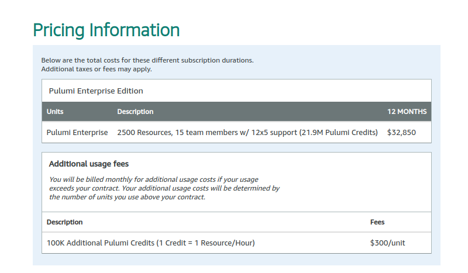
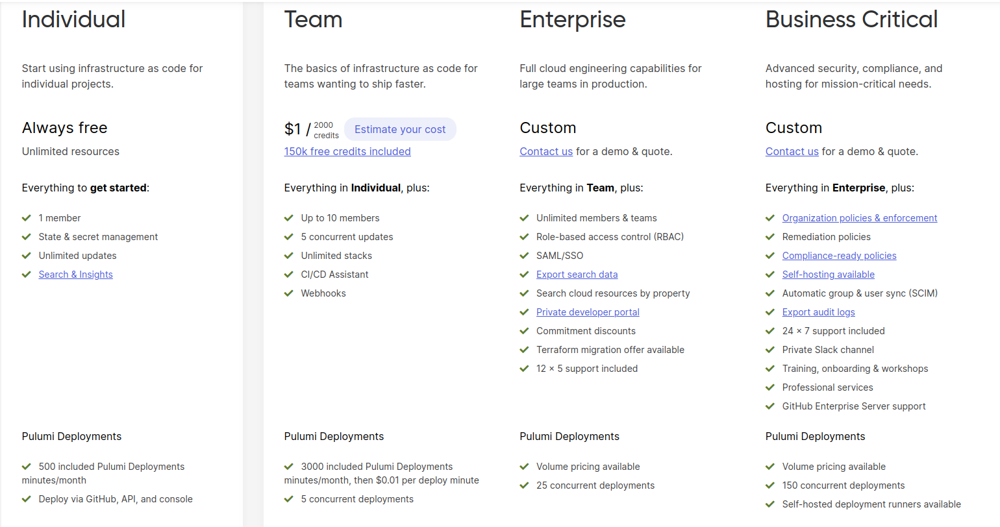

# Pricing

> **RUM pricing model (Resource Usage Monitoring)**  
> - The number of resources users create and manage within their IaC.  
> - Metering usage: number of resources created, duration for which they are provisioned, etc  
> - Billing calculation is based on tracked usage

## Pulumi Cloud
 Pulumi uses the RUM pricing model
Different pricing tiers are available (150k free credits on all tiers) :
- Free - single user
- Team - up to 10 users. $1 / 2000 credits
- Enterprise - unlimited users

AWS Marketplace - [Pulumi Enterprise Edition](https://aws.amazon.com/marketplace/pp/prodview-dwn22batkhsyg)

What does it give you?
Features include:
- State(Terraform only - Pulumi needs to be self managed) & secrets management
- CI/CD integrations like AWS Codepipeline and GitHub Actions
- Role-based access control (RBAC) with unlimited teams
- SAML/Single-sign-on
- Audit logs

Costing examples:
150k credits - manage 200 S3 buckets for a month(no policies, etc)
150k credits - manage 40 S3 buckets (with resources) for a month [S3 Example](Pulumi_Cloud.md#s3-resource-example)

---
## Terraform Cloud
Terraform uses the RUM pricing model

---
## Spacelift
[Spacelift IaC Management Platform](https://spacelift.io/)

Spacelift charges a flat fee with additional cost per agent 

### Enterprise costs

Annual flat fee - $18000

| Bucket | Cost per unit | 
|--------|---------------|
| 1-10   | $6000         |
| 11-20  | $5600         |
| ...    | ....          |

Total cost = Flat fee + (number_of_agents * unit_cost)

---